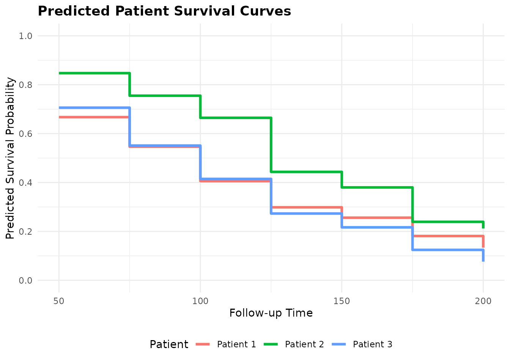
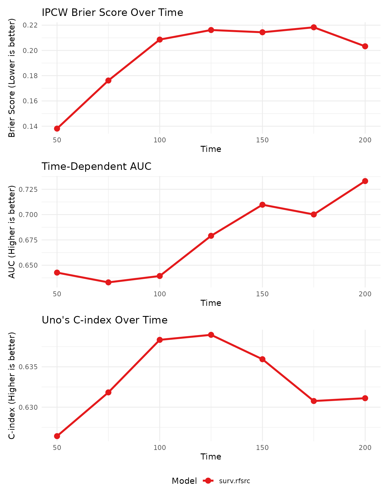
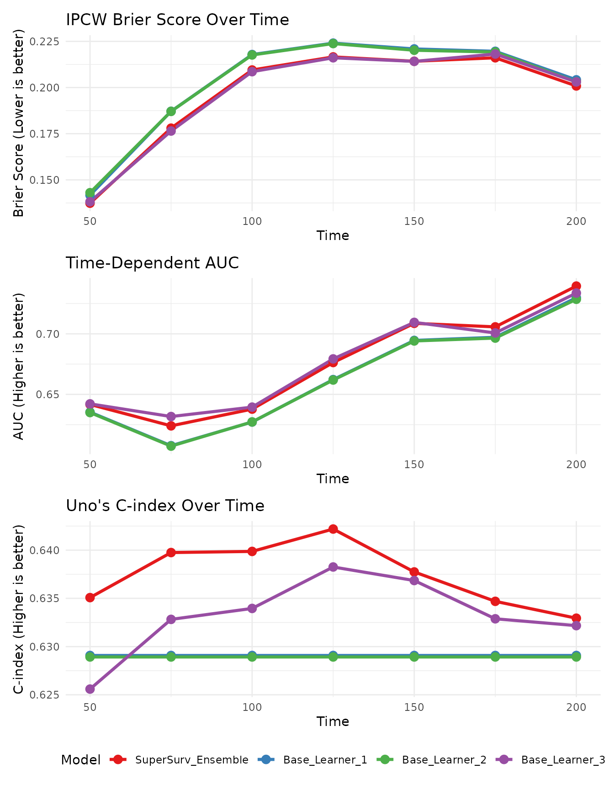

# 6. Machine Learning with Random Survival Forests

## Introduction

While classical models like the Cox Proportional Hazards model are
highly interpretable, they rely on strict assumptions of linear,
additive effects. Random Survival Forests (RSF) overcome this by
building a non-linear ensemble of decision trees.

In this tutorial, we will demonstrate how to run a standalone RSF using
`SuperSurv`’s unified wrappers, evaluate its individual performance, and
finally include it in a Super Learner ensemble.

## 1. Prepare the Data

``` r
library(SuperSurv)
library(survival)

data("metabric", package = "SuperSurv")
set.seed(123)

train_idx <- sample(1:nrow(metabric), 0.7 * nrow(metabric))
train <- metabric[train_idx, ]
test  <- metabric[-train_idx, ]

X_tr <- train[, grep("^x", names(metabric))]
X_te <- test[, grep("^x", names(metabric))]

new.times <- seq(50, 200, by = 25) 
```

## 2. Standalone Machine Learning

`SuperSurv` provides unified wrappers that automatically handle the
training and standardization of survival probabilities. You can use
these completely independent of the Super Learner ensemble.

``` r
# 1. Fit the standalone wrapper
rf_standalone <- surv.rfsrc(
  time = train$duration,
  event = train$event,
  X = X_tr,
  new.times = new.times 
)

# 2. Extract the fitted model object and prediction matrix
rf_fit <- rf_standalone$fit
rf_pred_matrix <- rf_standalone$pred
```

Because our plotting functions are universally compatible, we can plot
individual patient curves directly from this standalone matrix:

``` r
# Plot the first 3 patients in our training set
plot_predict(preds = rf_pred_matrix, eval_times = new.times, patient_idx = 1:3)
```



## 3. Evaluating the Standalone Model

We can also pass this standalone model directly into our evaluation
suite to test its performance on new data.

``` r
# The function automatically detects this is a single model and plots it!
plot_benchmark(
  object = rf_fit,
  newdata = X_te,
  time = test$duration,
  event = test$event,
  eval_times = new.times
)
#> Generating predictions for benchmark plots...
#> Calculating time-dependent metrics...
```



## 4. Train the Benchmark Ensemble

While the standalone RSF is powerful, we can objectively evaluate if it
outperforms classical models by putting them together in a `SuperSurv`
ensemble.

``` r
my_library <- c("surv.coxph", "surv.weibull", "surv.rfsrc")

fit_supersurv <- SuperSurv(
  time = train$duration,
  event = train$event,
  X = X_tr,
  newdata = X_te,
  new.times = new.times,
  event.library = my_library,
  cens.library = c("surv.coxph"), 
  control = list(saveFitLibrary = TRUE),
  verbose = FALSE,
  nFolds = 3
)
```

## 5. Visualizing Ensemble vs. Base Learners

When we pass the `SuperSurv` ensemble into the exact same benchmark
function, it automatically unpacks the library and plots the ensemble
against all its constituent models.

``` r
plot_benchmark(
  object = fit_supersurv,
  newdata = X_te,
  time = test$duration,
  event = test$event,
  eval_times = new.times
)
#> Generating predictions for benchmark plots...
#> Calculating time-dependent metrics...
```



By incorporating advanced machine learning algorithms into your library,
`SuperSurv` mathematically guarantees that your final predictions adapt
to the complexity of your data, achieving the lowest possible Brier
Score.
