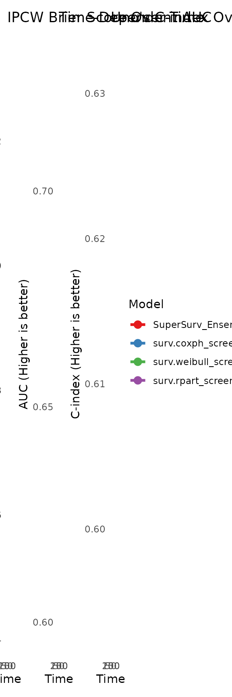
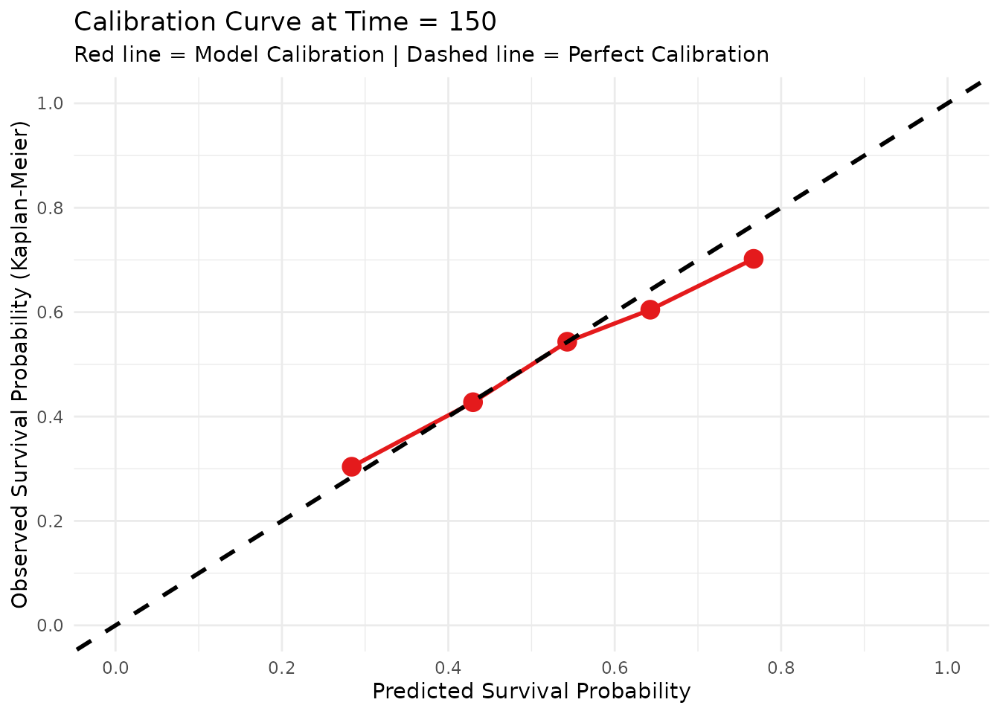

# 2. Model Performance & Benchmarking

## Introduction

Once a `SuperSurv` ensemble is trained, we must rigorously prove that it
outperforms the individual base learners. Because survival data involves
right-censoring, we cannot use standard classification metrics like
simple accuracy.

Instead, we evaluate the model across three critical dimensions: 1.
**Calibration:** Does the predicted survival probability match the
actual observed survival rate? 2. **Discrimination (AUC & C-index):**
Can the model correctly rank which patient will survive longer? 3.
**Overall Accuracy (Brier Score):** A combined measure of both
calibration and discrimination.

This tutorial demonstrates how to extract these metrics and visualize
the benchmark comparisons using `SuperSurv`’s built-in evaluation suite.

## 1. Data Preparation & The Extrapolation Rule

We begin by loading the `metabric` dataset and defining our evaluation
time grid (`new.times`).

**Crucial Methodological Note:** Your `new.times` grid should *never*
exceed the maximum observed follow-up time in your training cohort. For
example, if your training data only spans 1 to 100 days, predicting
survival at day 150 is extrapolation. Non-parametric models (like
Survival Trees) mathematically cannot extrapolate, and parametric models
(like Weibulls) will generate highly unreliable tail estimates. Always
bind your evaluation grid within the limits of your observed data!

``` r
library(SuperSurv)
library(survival)

data("metabric", package = "SuperSurv")
set.seed(123)
train_idx <- sample(1:nrow(metabric), 0.7 * nrow(metabric))
train <- metabric[train_idx, ]
test  <- metabric[-train_idx, ]

X_tr <- train[, grep("^x", names(metabric))]
X_te <- test[, grep("^x", names(metabric))]

# Our max follow-up is well beyond 200, so this grid is safe.
new.times <- seq(50, 200, by = 25) 
```

## 2. Train the Benchmark Ensemble

We will fit an ensemble consisting of a Cox model, a Weibull model, and
a Survival Tree using the default Least Squares meta-learner.

``` r
my_library <- c("surv.coxph", "surv.weibull", "surv.rpart")

fit_supersurv <- SuperSurv(
  time = train$duration,
  event = train$event,
  X = X_tr,
  newX = X_te,
  new.times = new.times,
  event.SL.library = my_library,
  cens.SL.library = my_library,
  control = list(saveFitLibrary = TRUE),
  verbose = FALSE,
  nFolds = 3
)
```

## 3. Extracting Integrated Metrics

The
[`eval_summary()`](https://yuelyu21.github.io/SuperSurv/reference/eval_summary.md)
function automatically generates predictions on your test set and
returns a clean, comparative table of the *integrated* metrics across
your entire time grid.

``` r
# Evaluate performance directly using the fitted model and test data
performance_results <- eval_summary(
  object = fit_supersurv,
  newdata = X_te,
  time = test$duration,
  event = test$event,
  eval_times = new.times
)
#> 
#> Generating predictions on test data...
#> Evaluating SuperSurv Ensemble...
#> Evaluating Base Learner 1/3: surv.coxph_screen.all...
#> Evaluating Base Learner 2/3: surv.weibull_screen.all...
#> Evaluating Base Learner 3/3: surv.rpart_screen.all...
#> 
#> ========================================================
#>              SuperSurv Evaluation Benchmark             
#> ========================================================
#>                    Model    IBS  Uno_C   iAUC
#>       SuperSurv_Ensemble 0.2056 0.6317 0.6645
#>    surv.coxph_screen.all 0.2071 0.6291 0.6619
#>  surv.weibull_screen.all 0.2068 0.6289 0.6615
#>    surv.rpart_screen.all 0.2156 0.5931 0.6266
#> ========================================================
#> * IBS & iAUC integrated over: [50.00, 200.00]
#> * Uno's C-index evaluated using risk at time: 125.00
#> Note: Lower IBS is better. Higher Uno_C and iAUC are better.
```

*Note: Look for the model with the lowest IBS (Integrated Brier Score)
and the highest iAUC/Uno’s C-index.*

## 4. Visualizing Longitudinal Benchmarks

A single integrated number rarely tells the whole story. Different
models excel at different follow-up periods (e.g., a Cox model might
dominate short-term survival, while a Random Forest dominates
long-term).

The
[`plot_benchmark()`](https://yuelyu21.github.io/SuperSurv/reference/plot_benchmark.md)
function generates a stacked dashboard to visualize this dynamic
performance over time.

``` r
plot_benchmark(
  object = fit_supersurv,
  newdata = X_te,
  time = test$duration,
  event = test$event,
  eval_times = new.times
)
#> Generating predictions for benchmark plots...
#> Calculating time-dependent metrics...
```



### Interpreting the Curves:

- **IPCW Brier Score Plot:** Look for the curve that stays the *lowest*.
  The `SuperSurv` ensemble should ideally hug the bottom edge.
- **Time-Dependent AUC Plot:** Look for the curve that stays the
  *highest* (closest to 1.0).
- **Uno’s C-index Plot:** Evaluates the global C-index using the
  specific predictions generated at each time point. Look for the curve
  that stays the *highest*.

## 5. Assessing Clinical Calibration

Before deploying a model to the clinic, doctors need to know if the
probabilities are reliable. If the model predicts a patient has a 40%
chance of surviving past Time = 100, do exactly 40% of similar patients
actually survive?

We use
[`plot_calibration()`](https://yuelyu21.github.io/SuperSurv/reference/plot_calibration.md)
to evaluate this at a specific clinical milestone. The function groups
patients into risk quantiles and plots their predicted probability
against the actual observed Kaplan-Meier survival rate.

``` r
# Assess calibration specifically at Time = 150
plot_calibration(
  object = fit_supersurv,
  newdata = X_te,
  time = test$duration,
  event = test$event,
  eval_time = 150,
  bins = 5 # Group patients into 5 risk quintiles
)
```



**Interpretation:** A perfectly calibrated model will follow the
45-degree dashed black line. Points above the line indicate the model is
*under-predicting* survival (being too pessimistic), while points below
the line indicate it is *over-predicting* survival (being too
optimistic).
