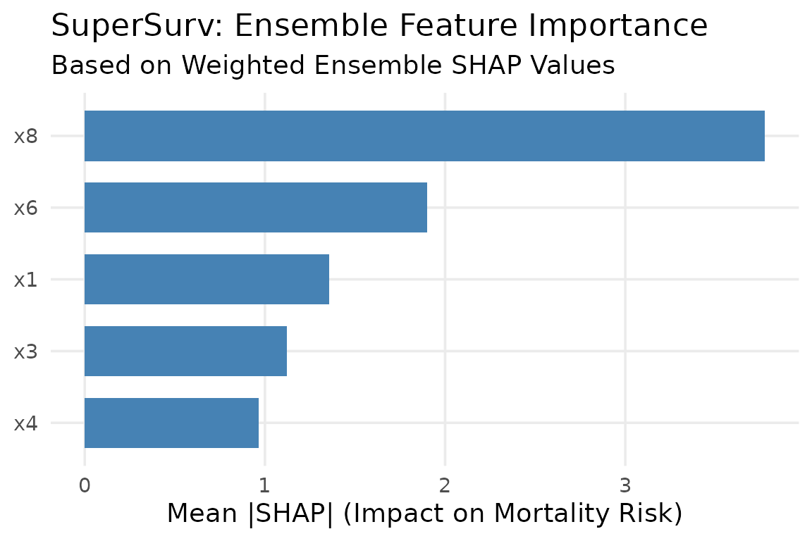
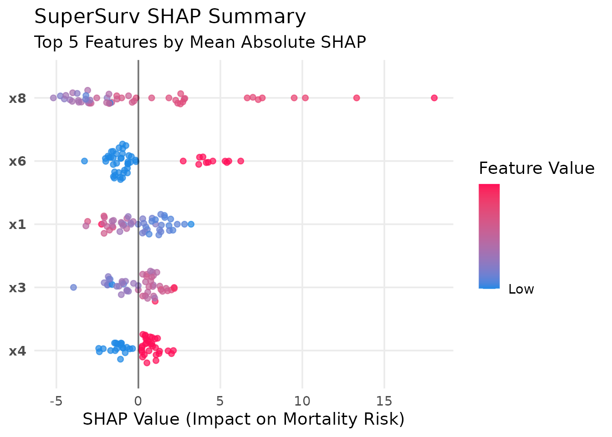
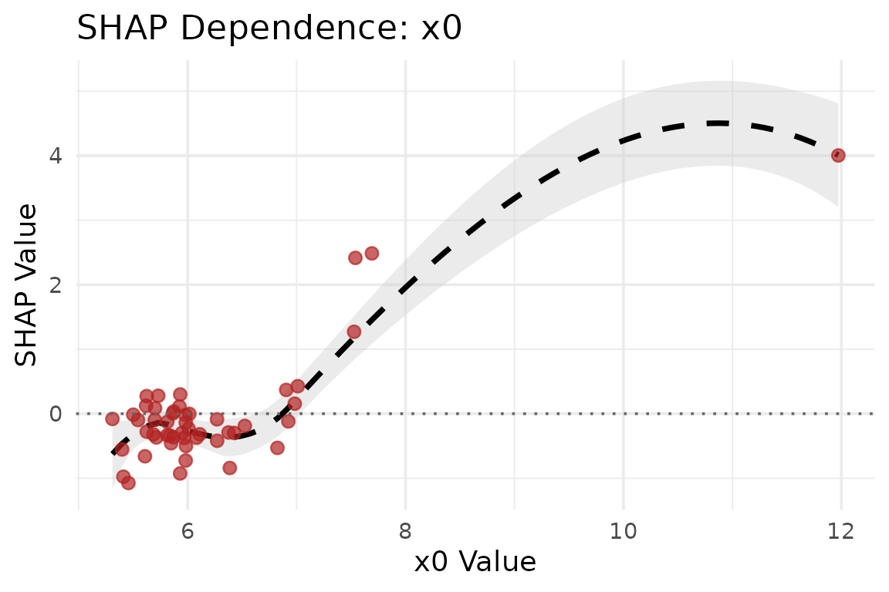
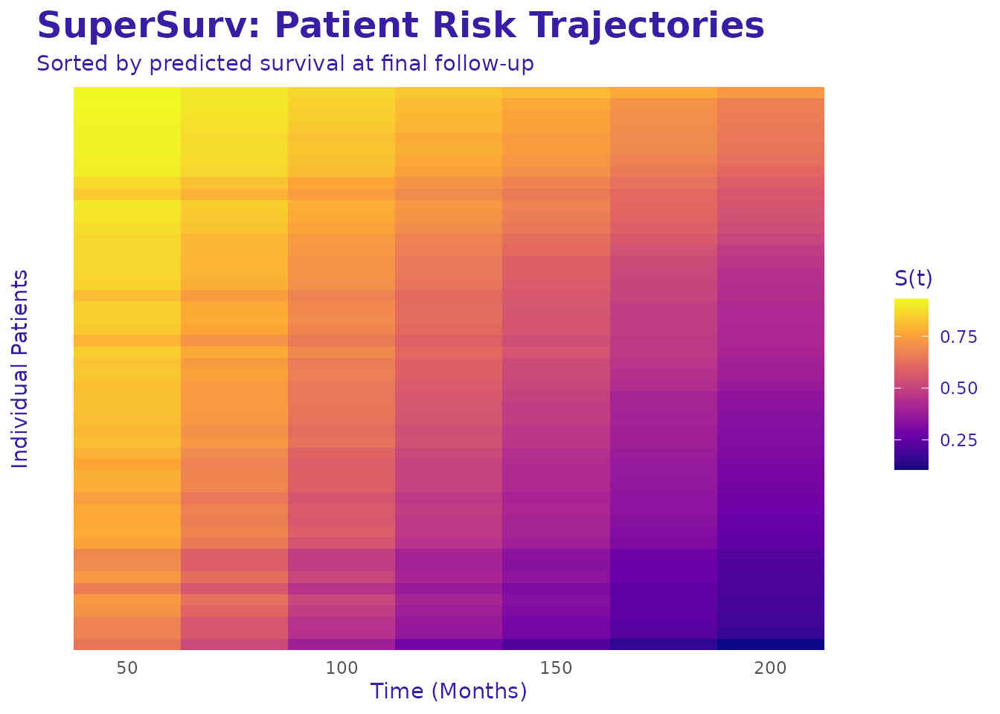

# 7. Interpreting the Black Box with SHAP

## Introduction

Machine learning models, particularly tree-based algorithms and deep
ensembles, are notoriously criticized as “black boxes.” While they often
achieve superior predictive performance compared to classical linear
models, clinicians and bioinformaticians need to know *why* a model is
making a specific prediction.

`SuperSurv` solves this using **SHAP (SHapley Additive exPlanations)**.
Because Shapley values possess the mathematical property of linearity,
`SuperSurv` can calculate the SHAP values for every active base learner
and seamlessly combine them using the meta-learner’s weights.

This tutorial covers Global feature importance, Local (patient-level)
explanations, Feature dependence, and Time-Dependent survival heatmaps.

## 1. Setup and Model Fitting

Let’s train a diverse Super Learner on our `metabric` dataset.

``` r
library(SuperSurv)
library(survival)

# Load data
data("metabric", package = "SuperSurv")
set.seed(42)

train_idx <- sample(1:nrow(metabric), 0.7 * nrow(metabric))
train <- metabric[train_idx, ]
test  <- metabric[-train_idx, ]

X_tr <- train[, grep("^x", names(metabric))]
X_te <- test[, grep("^x", names(metabric))]
new.times <- seq(50, 200, by = 25)

# Fit a diverse library
my_library <- c("surv.coxph", "surv.weibull", "surv.rpart")

fit_sl <- SuperSurv(
  time = train$duration,
  event = train$event,
  X = X_tr,
  newX = X_te,
  new.times = new.times,
  event.SL.library = my_library,
  cens.SL.library = c("surv.coxph"),
  control = list(saveFitLibrary = TRUE),
  verbose = FALSE,
  selection = "ensemble",
  nFolds = 3
)
```

## 2. Global Explanations (Kernel SHAP)

To calculate SHAP values, we need an `X_explain` dataset (the patients
we want to explain) and an `X_background` dataset (a reference
population used to calculate the baseline average risk).

``` r
# For speed in this tutorial, we explain the first 50 test patients
# using 100 training patients as the background reference.
X_explain_subset <- X_te[1:50, ]
X_background_subset <- X_tr[1:100, ]

# Calculate weighted Ensemble SHAP values
shap_vals <- explain_shap(
  model = fit_sl, 
  X_explain = X_explain_subset, 
  X_background = X_background_subset, 
  nsim = 20
)
```

### Global Importance Bar Plot

Which features drive the ensemble’s mortality risk predictions across
the entire cohort?

``` r
plot_global_importance(shap_vals, top_n = 5)
```



### SHAP Beeswarm Summary Plot

The beeswarm plot is the gold standard for SHAP. It shows both the
magnitude of a feature’s impact and the direction of its effect based on
the feature’s actual value.

``` r
plot_beeswarm(shap_vals, data = X_explain_subset, top_n = 5)
```

*Interpretation:
A red dot (high feature value) on the right side of the vertical
zero-line indicates that higher values of this biomarker increase
mortality risk.*

## 3. Local (Patient-Level) Explanations

In precision medicine, we often need to explain why a *specific* patient
has a high or low risk score. The Waterfall plot breaks down the exact
algorithmic logic for an individual.

``` r
# Explain Patient #1 from our test subset
plot_patient_waterfall(shap_vals, patient_index = 1, top_n = 5)
```


## 4. Feature Dependence Plots

Does a specific biomarker have a linear or non-linear relationship with
mortality risk? A dependence plot visualizes how the algorithm uses a
specific feature across its entire distribution.

``` r
# Let's look at the relationship for feature 'x0'
plot_dependence(shap_vals, data = X_explain_subset, feature_name = "x0")
```



## 5. Time-Dependent Explanations (Survex Integration)

Traditional SHAP looks at an overall “risk score,” but survival analysis
is fundamentally about *time*. `SuperSurv` natively bridges to the
`survex` package to evaluate predictions across the survival curve
$S(t)$.

We can visualize patient trajectories over time using a survival
heatmap.

``` r
# Plot the survival trajectories for the first 50 test patients
plot_survival_heatmap(fit_sl, newdata = X_explain_subset, times = new.times)
```

*Interpretation:
Patients at the top experience rapid drops in survival probability (high
risk), while patients at the bottom maintain high survival probabilities
throughout the follow-up period.*

By utilizing these SHAP tools, `SuperSurv` ensures that your advanced
machine learning ensembles remain completely transparent, interpretable,
and ready for clinical deployment.
