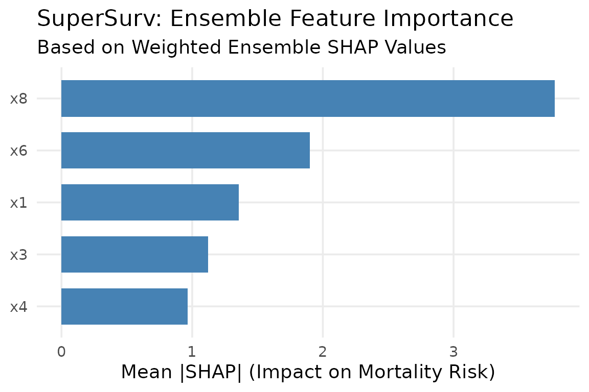
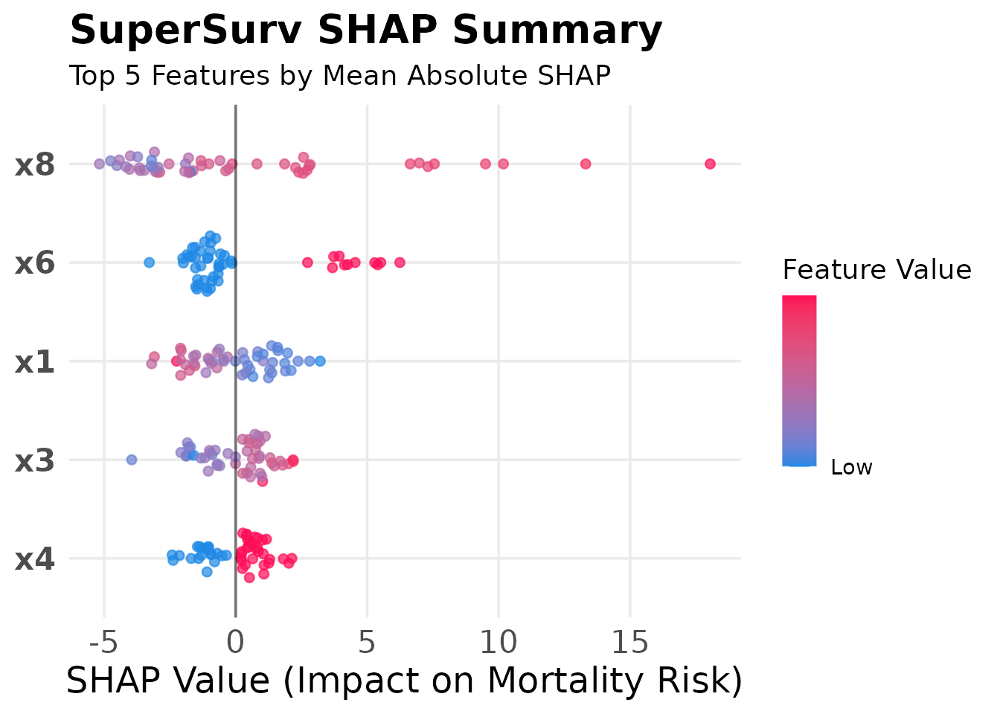
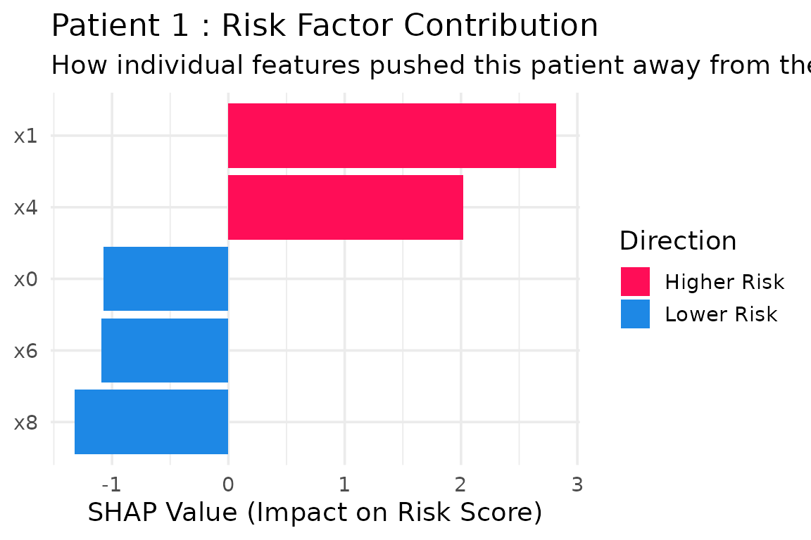
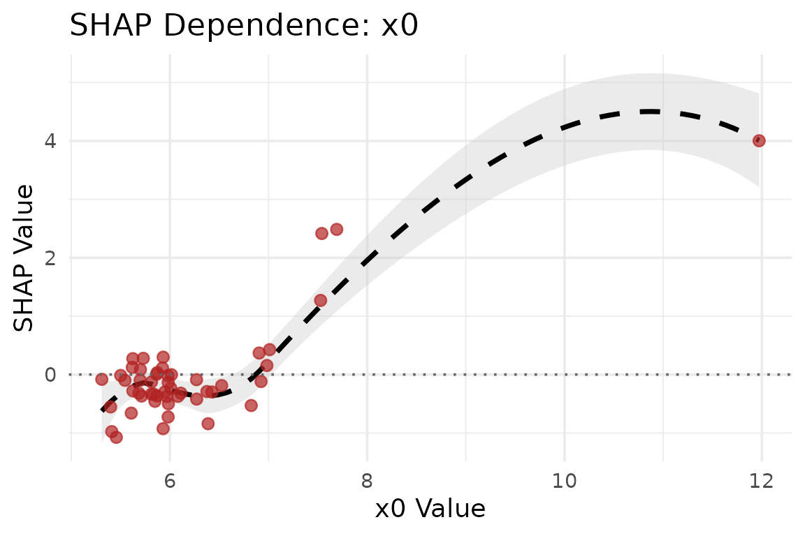
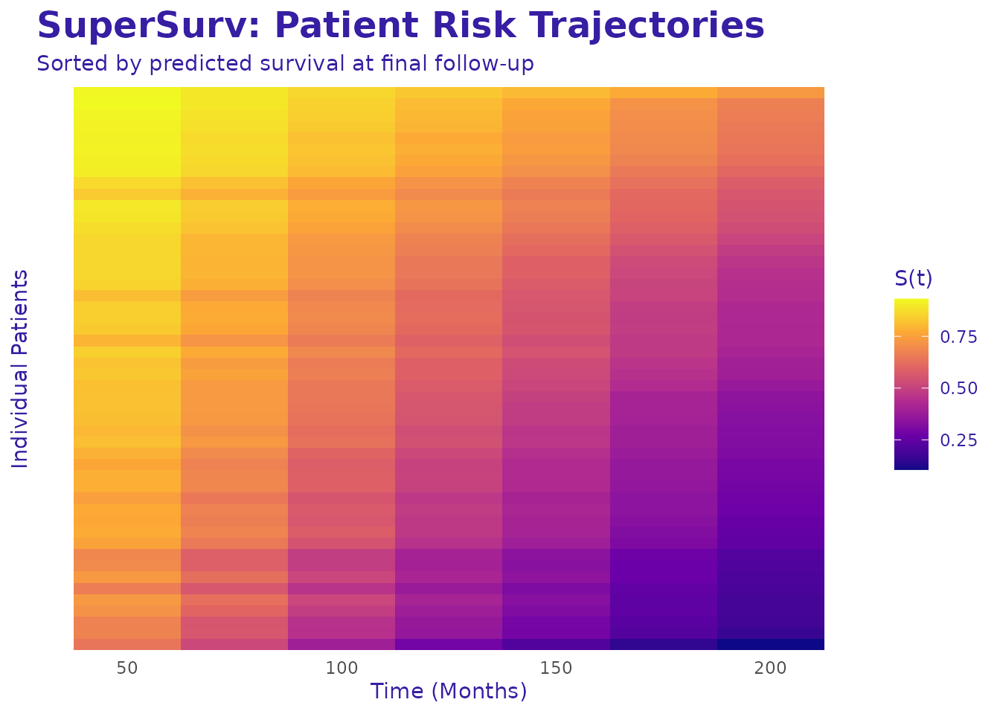
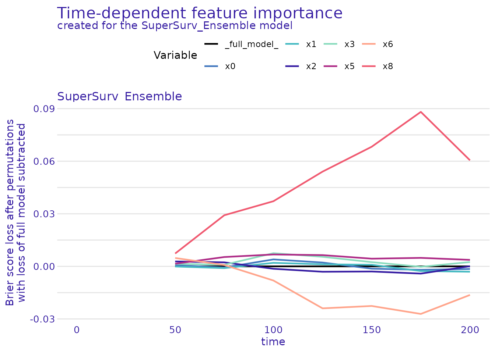
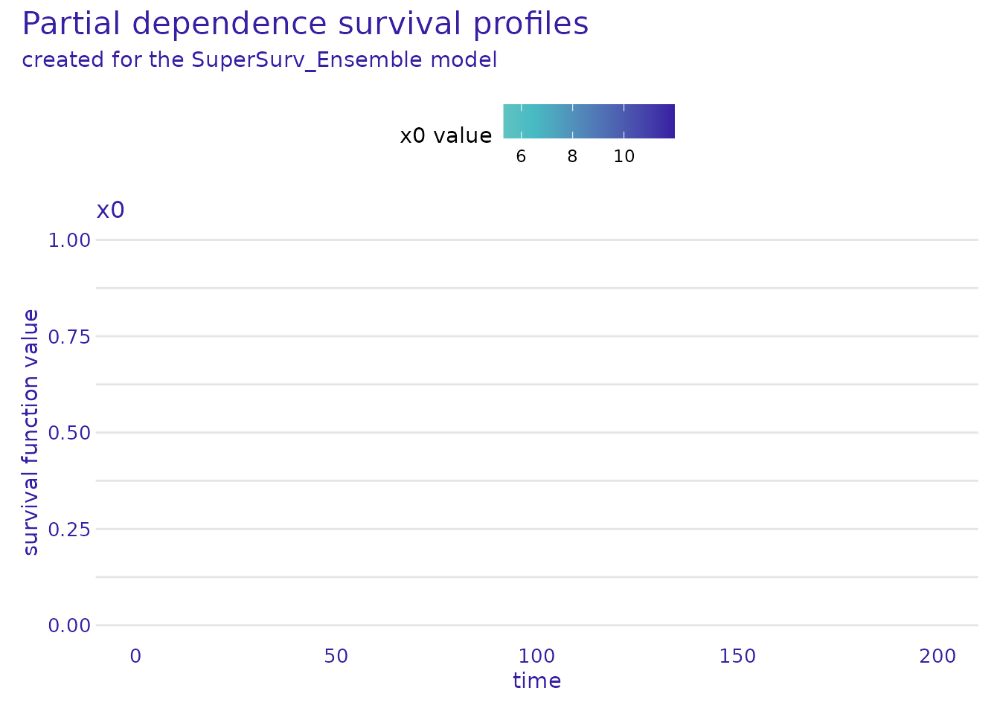
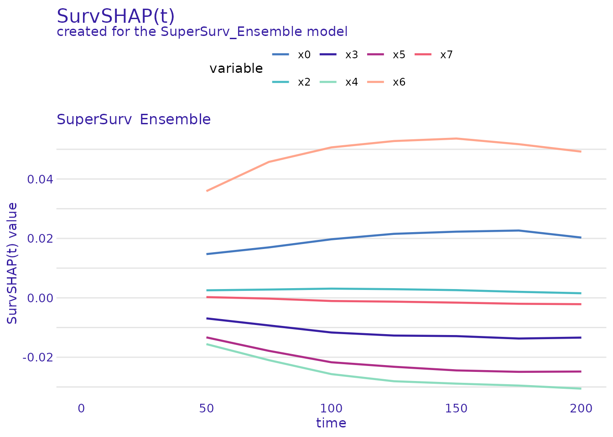
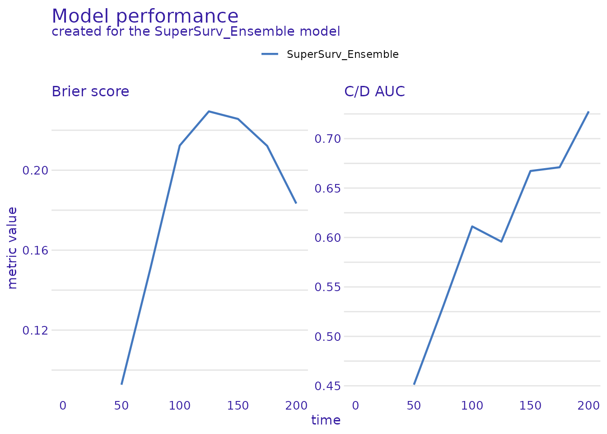

# 8. Interpreting the Black Box with SHAP & survex

## Introduction

Machine learning models are notoriously criticized as “black boxes.”
While they often achieve superior predictive performance, clinicians
need to know *why* a model is making a specific prediction.

`SuperSurv` solves this using **SHAP (SHapley Additive exPlanations)**.
Because Shapley values possess the mathematical property of linearity,
`SuperSurv` can calculate the SHAP values for every active base learner
and seamlessly combine them using the meta-learner’s weights.

This tutorial covers Global feature importance, Local (patient-level)
explanations, and Time-Dependent survival analysis using the `survex`
package.

## 1. Setup and Model Fitting

Let’s train a diverse Super Learner on our `metabric` dataset.

``` r
library(SuperSurv)
library(survival)

data("metabric", package = "SuperSurv")
set.seed(42)

train_idx <- sample(1:nrow(metabric), 0.7 * nrow(metabric))
train <- metabric[train_idx, ]
test  <- metabric[-train_idx, ]

X_tr <- train[, grep("^x", names(metabric))]
X_te <- test[, grep("^x", names(metabric))]
new.times <- seq(50, 200, by = 25)

my_library <- c("surv.coxph", "surv.weibull", "surv.rfsrc")

fit_sl <- SuperSurv(
  time = train$duration,
  event = train$event,
  X = X_tr,
  newdata = X_te,
  new.times = new.times,
  event.library = my_library,
  cens.library = c("surv.coxph"),
  verbose = FALSE,
  selection = "ensemble",
  nFolds = 3
)
```

## 2. Global Explanations (Kernel SHAP)

To calculate static risk SHAP values, we need an `X_explain` dataset
(the patients we want to explain) and an `X_background` dataset (a
reference population used to calculate the baseline average risk).

``` r
# Explain the first 50 test patients using 100 training patients as the background
X_explain_subset <- X_te[1:50, ]
X_background_subset <- X_tr[1:100, ]

# Calculate weighted Ensemble SHAP values using Kernel SHAP
shap_vals <- explain_kernel(
  model = fit_sl, 
  X_explain = X_explain_subset, 
  X_background = X_background_subset, 
  nsim = 20
)
```

### Global Importance Bar Plot

Which features drive the ensemble’s mortality risk predictions across
the entire cohort?

``` r
plot_global_importance(shap_vals, top_n = 5)
```



### SHAP Beeswarm Summary Plot

The beeswarm plot is the gold standard for SHAP. It shows both the
magnitude of a feature’s impact and the direction of its effect.

``` r
plot_beeswarm(shap_vals, data = X_explain_subset, top_n = 5)
```

*Interpretation:
A red dot (high feature value) on the right side of the vertical
zero-line indicates that higher values of this biomarker increase
mortality risk.*

## 3. Local (Patient-Level) Explanations

In precision medicine, we often need to explain why a *specific* patient
has a high risk score. The Waterfall plot breaks down the exact
algorithmic logic for an individual.

``` r
# Explain Patient #1 from our test subset
plot_patient_waterfall(shap_vals, patient_index = 1, top_n = 5)
```



## 4. Feature Dependence Plots

Does a specific biomarker have a linear or non-linear relationship with
mortality risk?

``` r
plot_dependence(shap_vals, data = X_explain_subset, feature_name = "x0")
```



## 5. Patient Risk Trajectories (Survival Heatmap)

We can visualize patient trajectories over time using a survival heatmap
generated directly from `SuperSurv` predictions.

``` r
# Plot the survival trajectories for the first 50 test patients
plot_survival_heatmap(fit_sl, newdata = X_explain_subset, times = new.times)
```

*Interpretation:
Patients at the top experience rapid drops in survival probability (high
risk), while patients at the bottom maintain high survival
probabilities.*

## 6. Time-Dependent Explanations (`survex` Integration)

Traditional SHAP looks at an overall “risk score,” but survival analysis
is fundamentally about *time*. A feature might be highly predictive of
early mortality (Time = 50) but irrelevant for long-term survival (Time
= 200).

`SuperSurv` natively bridges to the `survex` package to evaluate dynamic
feature importance across the entire survival curve $S(t)$.

``` r
library(survex)

# 1. Create the true survival object for the explanation subset
y_explain <- survival::Surv(test$duration[1:50], test$event[1:50])

# 2. Build the survex explainer using our custom function
surv_explainer <- explain_survex(
  model = fit_sl, 
  data = X_explain_subset, 
  y = y_explain, 
  times = new.times
)
```

Once the explainer is created, you have full access to the `survex`
ecosystem. Let’s look at three powerful time-dependent visualizations.

### A. Dynamic Feature Importance

Which features are driving the model’s predictions at different clinical
milestones?

``` r
# Calculate time-dependent model parts (permutation feature importance)
time_importance <- model_parts(surv_explainer)

# Plot the dynamic importance over time
plot(time_importance)
```

*Interpretation:
If a feature’s curve rises over time, it means that biomarker becomes
more critical for predicting long-term survival.*

### B. Time-Dependent Partial Dependence Profiles

How does the value of a specific continuous feature (e.g., `x0`) change
the average survival probability over time?

``` r
# Calculate the partial dependence profile for feature 'x0'
pdp_time <- model_profile(surv_explainer, variables = "x0")

plot(pdp_time)
```

*Interpretation:
This generates a 3D-like profile showing how different values of `x0`
shift the entire survival curve.*

### C. SurvSHAP(t): Local Explanations Over Time

Just like the Waterfall plot explains a static risk score, SurvSHAP(t)
explains exactly how a specific patient’s features pushed their survival
probability up or down *at every single time point*.

``` r
# Explain Patient #1 over time
patient_1_data <- X_explain_subset[1, , drop = FALSE]

# Calculate SurvSHAP(t)
survshap_t <- predict_parts(surv_explainer, new_observation = patient_1_data, type = "survshap")

plot(survshap_t)
```

*Interpretation:
The solid black line is the model’s average survival curve. The colored
areas show how Patient 1’s specific covariates (like their specific age
or tumor grade) dragged their personal survival curve above or below the
average over time.*

### D. Ecosystem Compatibility: Global Model Performance

Because
[`explain_survex()`](https://yuelyu21.github.io/SuperSurv/reference/explain_survex.md)
creates a standard explainer object, you aren’t just limited to SHAP
values. You can utilize the entire `survex` ecosystem, including their
built-in performance metrics.

While `SuperSurv` provides its own comprehensive benchmarking suite
(`plot_benchmark`), you can easily cross-validate your ensemble’s
Time-Dependent Brier Score and AUC using `survex`’s native functions:

``` r
# Calculate time-dependent performance metrics via survex
survex_perf <- model_performance(surv_explainer)

# Plot the Brier score and AUC curves
plot(survex_perf)
```

*Note:
The Brier score should ideally stay as low as possible over time, while
the AUC should remain high. This serves as an excellent independent
validation of the results generated by `SuperSurv`’s native
[`eval_summary()`](https://yuelyu21.github.io/SuperSurv/reference/eval_summary.md)!*

By utilizing these tools, `SuperSurv` ensures that your advanced machine
learning ensembles remain completely transparent, dynamically
interpretable, and ready for clinical deployment.
