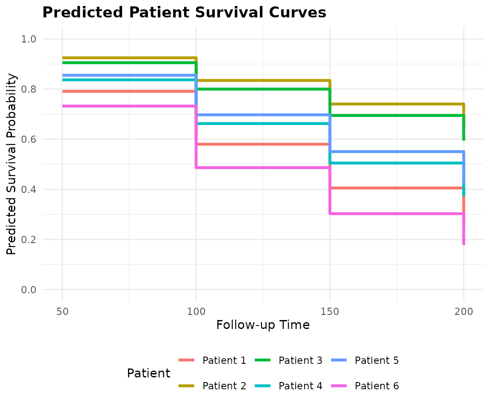

# 01. SuperSurv with Ensemble

## Introduction

The core feature of the `SuperSurv` package is its ability to combine
multiple base survival learners into a highly predictive meta-ensemble.
This tutorial walks through preparing data, defining a library of
models, fitting the Super Learner, and generating predictions for new
patients.

## 1. Load Data & Prepare Matrices

We will use the built-in `metabric` dataset, extracting the covariates
and performing a standard 80/20 train-test split.

``` r

library(SuperSurv)
library(survival)

# Load built-in METABRIC data
data("metabric", package = "SuperSurv")

# Quick 80/20 Train-Test split
set.seed(42)
n_total <- nrow(metabric)
train_idx <- sample(1:n_total, 0.8 * n_total)

train <- metabric[train_idx, ]
test  <- metabric[-train_idx, ]

# Extract just the X covariates (assuming they are named x0, x1, etc.)
x_cols <- grep("^x", names(metabric), value = TRUE)
X_tr <- train[, x_cols]
X_te <- test[, x_cols]

# Define the prediction time grid (e.g., survival at 50, 100, 150, 200 months)
new.times <- c(50, 100, 150, 200)
```

## 2. Define the Ensemble Library

We define a library of base survival models. For this quick
demonstration, we use lightning-fast parametric and tree-based models.

``` r

my_library <- c("surv.coxph", "surv.weibull", "surv.rpart")
```

## 3. Train the SuperSurv Metalearner

Before we run the main `SuperSurv` engine, it is important to understand
its key parameters. The Super Learner algorithm relies on
cross-validation to assign weights to the base models, and it must model
both the event and the censoring mechanism to avoid biased evaluations.

Here is the complete guide to the arguments you need to pass:

### The Data Inputs

- **`time`**: A numeric vector of the observed follow-up times for your
  training cohort.
- **`event`**: A numeric vector indicating the status at the observed
  time (typically `1` = event occurred, `0` = right-censored).
- **`X`**: A `data.frame` or matrix containing **only** the predictor
  variables (covariates) for the training set. Do not include the time
  or event columns here!
- **`newdata`**: (Optional) A `data.frame` of covariates for a
  validation or test set. If provided, `SuperSurv` will immediately
  generate predictions for these patients during the training phase,
  saving you a step.
- **`new.times`**: A numeric vector defining the exact time points where
  you want survival probabilities predicted (e.g.,
  `seq(50, 200, by = 25)`).

### The Model Libraries

- **`event.library`**: A character vector of the base algorithms used to
  predict the actual survival outcome (e.g., `"surv.coxph"`,
  `"surv.rpart"`).
- **`cens.library`**: The library used to estimate the *censoring*
  mechanism over time. `SuperSurv` uses these predictions to calculate
  Inverse Probability of Censoring Weights (IPCW). You can use the exact
  same library as your event models, or a simpler one.

### The Meta-Learner & Tuning

- **`metalearner`**: The optimization algorithm used to calculate the
  final ensemble weights. `SuperSurv` offers two distinct approaches:
  - `"brier"` (Default): Optimizes weights by minimizing the IPCW Brier
    score. Excellent for overall prediction accuracy.
  - `"logloss"`: Optimizes weights by minimizing the negative
    log-likelihood. Excellent for improving hazard discrimination.
- **`nFolds`**: The number of cross-validation folds used to train the
  meta-learner. `V = 5` or `V = 10` is standard. This cross-validation
  is what prevents the ensemble from overfitting to the base learners.
- **`control = list(saveFitLibrary = TRUE)`**: This tells the engine to
  save the fitted base learners into the final object. This is
  **required** if you want to use the
  [`predict()`](https://rdrr.io/r/stats/predict.html) method on new
  patients later.
- **`verbose`**: Set to `TRUE` to print progress messages to the
  console. Highly recommended for large datasets or complex libraries so
  you can track the cross-validation progress.

Let’s fit two models with `verbose = FALSE` to see how the meta-learner
choice affects the final ensemble weights.

``` r

# Fit 1: Least Squares Meta-learner
fit_ls <- SuperSurv(
  time = train$duration,
  event = train$event,
  X = X_tr,
  newdata = X_te,                 # Predict on the test set immediately
  new.times = new.times,       # Our evaluation time grid
  event.library = my_library,
  cens.library = my_library,
  metalearner = "brier", 
  control = list(saveFitLibrary = TRUE), 
  verbose = T,             # Turn to TRUE in practice to see progress!
  selection = "ensemble",
  nFolds = 5                   # 5-fold CV for the meta-learner
)

# Fit 2: Negative Log-Likelihood Meta-learner
fit_nll <- SuperSurv(
  time = train$duration,
  event = train$event,
  X = X_tr,
  newdata = X_te,
  new.times = new.times,
  event.library = my_library,
  cens.library = my_library,
  metalearner = "logloss",       # Swap to nloglik
  control = list(saveFitLibrary = TRUE), 
  verbose = FALSE,
  selection = "ensemble",
  nFolds = 5
)
```

## 4. Package Object Interface

`SuperSurv` fits behave like ordinary R model objects. Use the print and
summary methods for a quick overview, and use accessors for common
fitted-model details.

``` r

fit_ls
#> SuperSurv fit
#>   Selection: ensemble 
#>   Event learners: 3 
#>   Censoring learners: 3 
#>   Predictions: 381 observations x 4 times
#>   Evaluation times: 4 values from 50 to 200 
#>   Nonzero event weights:
#> surv.weibull_screen.all   surv.coxph_screen.all   surv.rpart_screen.all 
#>                  0.5906                  0.2344                  0.1750

summary(fit_ls)
#> Summary of SuperSurv fit
#>   Selection: ensemble 
#> 
#> Call:
#> SuperSurv(time = train$duration, event = train$event, X = X_tr, 
#>     newdata = X_te, new.times = new.times, event.library = my_library, 
#>     cens.library = my_library, verbose = T, control = list(saveFitLibrary = TRUE), 
#>     metalearner = "brier", selection = "ensemble", nFolds = 5)
#> 
#> Event ensemble:
#>                  learner weight   risk status
#>  surv.weibull_screen.all 0.5906 0.4854     ok
#>    surv.coxph_screen.all 0.2344 0.4856     ok
#>    surv.rpart_screen.all 0.1750 0.4958     ok
#> 
#> Censoring ensemble:
#>                  learner weight   risk status
#>    surv.coxph_screen.all 0.0689 1.0627     ok
#>  surv.weibull_screen.all 0.5611 1.0720     ok
#>    surv.rpart_screen.all 0.3700 1.0754     ok
#> 
#> Predictions: 381 observations x 4 times
#> Evaluation times: 4 values from 50 to 200 
#> Elapsed time (seconds):
#> everything      train    predict 
#>      3.836      3.589      0.241

event_weights(fit_ls)
#>   surv.coxph_screen.all surv.weibull_screen.all   surv.rpart_screen.all 
#>               0.2344382               0.5906097               0.1749521

learner_names(fit_ls)
#> [1] "surv.coxph_screen.all"   "surv.weibull_screen.all"
#> [3] "surv.rpart_screen.all"

eval_times(fit_ls)
#> [1]  50 100 150 200

selected_variables(fit_ls, learner = 1)
#> [1] "x0" "x1" "x2" "x3" "x4" "x5" "x6" "x7" "x8"
```

## 5. Inspect the Ensemble Weights and Risks

The defining feature of the Super Learner is that it does not just pick
the single “best” model; it finds the optimal weighted combination of
all models based on their cross-validated performance.

Let’s inspect the weights and cross-validated risks for both of our
meta-learners.

``` r

cat("\n--- LEAST SQUARES METALEARNER ---\n")
#> 
#> --- LEAST SQUARES METALEARNER ---
summary(fit_ls)
#> Summary of SuperSurv fit
#>   Selection: ensemble 
#> 
#> Call:
#> SuperSurv(time = train$duration, event = train$event, X = X_tr, 
#>     newdata = X_te, new.times = new.times, event.library = my_library, 
#>     cens.library = my_library, verbose = T, control = list(saveFitLibrary = TRUE), 
#>     metalearner = "brier", selection = "ensemble", nFolds = 5)
#> 
#> Event ensemble:
#>                  learner weight   risk status
#>  surv.weibull_screen.all 0.5906 0.4854     ok
#>    surv.coxph_screen.all 0.2344 0.4856     ok
#>    surv.rpart_screen.all 0.1750 0.4958     ok
#> 
#> Censoring ensemble:
#>                  learner weight   risk status
#>    surv.coxph_screen.all 0.0689 1.0627     ok
#>  surv.weibull_screen.all 0.5611 1.0720     ok
#>    surv.rpart_screen.all 0.3700 1.0754     ok
#> 
#> Predictions: 381 observations x 4 times
#> Evaluation times: 4 values from 50 to 200 
#> Elapsed time (seconds):
#> everything      train    predict 
#>      3.836      3.589      0.241

cat("\n--- NLOGLIK METALEARNER ---\n")
#> 
#> --- NLOGLIK METALEARNER ---
summary(fit_nll)
#> Summary of SuperSurv fit
#>   Selection: ensemble 
#> 
#> Call:
#> SuperSurv(time = train$duration, event = train$event, X = X_tr, 
#>     newdata = X_te, new.times = new.times, event.library = my_library, 
#>     cens.library = my_library, verbose = FALSE, control = list(saveFitLibrary = TRUE), 
#>     metalearner = "logloss", selection = "ensemble", nFolds = 5)
#> 
#> Event ensemble:
#>                  learner weight   risk status
#>    surv.coxph_screen.all 0.9929 0.4520     ok
#>  surv.weibull_screen.all 0.0042 0.4583     ok
#>    surv.rpart_screen.all 0.0029 0.4800     ok
#> 
#> Censoring ensemble:
#>                  learner weight   risk status
#>    surv.coxph_screen.all 0.0563 1.0840     ok
#>    surv.rpart_screen.all 0.4646 1.0848     ok
#>  surv.weibull_screen.all 0.4790 1.0932     ok
#> 
#> Predictions: 381 observations x 4 times
#> Evaluation times: 4 values from 50 to 200 
#> Elapsed time (seconds):
#> everything      train    predict 
#>     14.414     14.167      0.244
```

### How to Interpret This:

- **`event_weights(fit)`**: These are the final weights assigned to each
  base learner. A weight of `0` means the meta-learner completely
  dropped that model because it did not contribute to overall predictive
  accuracy. A high weight means that model heavily influences the final
  ensemble prediction. Notice how the `least_squares` and `nloglik`
  algorithms might distribute these weights differently based on their
  optimization goals!
- **`summary(fit)`**: This reports the cross-validated risk for each
  individual base learner. The meta-learner uses these risks to
  calculate the optimal weights. Lower risk always indicates better
  performance.

## 6. Generating Predictions on New Data

If you passed `newdata` during the training phase, `SuperSurv` already
calculated the predictions for your test set. However, in a real-world
clinical setting, you will often train the model once and then predict
on brand new patients months later.

Because we set `control = list(saveFitLibrary = TRUE)` during training,
we can use the standard R
[`predict()`](https://rdrr.io/r/stats/predict.html) method.

``` r

# Select 3 brand new patients from our test set
new_patients <- X_te[1:6, ]

# Generate predictions using the Least Squares ensemble
ensemble_preds <- predict(
  object = fit_ls, 
  newdata = new_patients, 
  new.times = new.times,
  type = "event"
)

cat("\n--- PREDICTED SURVIVAL PROBABILITIES ---\n")
#> 
#> --- PREDICTED SURVIVAL PROBABILITIES ---
final_matrix <- ensemble_preds
colnames(final_matrix) <- paste0("Time_", new.times)
rownames(final_matrix) <- paste0("Patient_", 1:6)

print(round(final_matrix, 4))
#>           Time_50 Time_100 Time_150 Time_200
#> Patient_1  0.7910   0.5800   0.4053   0.2717
#> Patient_2  0.9249   0.8344   0.7404   0.6473
#> Patient_3  0.9054   0.8000   0.6948   0.5944
#> Patient_4  0.8369   0.6624   0.5048   0.3720
#> Patient_5  0.8552   0.6974   0.5504   0.4219
#> Patient_6  0.7321   0.4865   0.3026   0.1775
```

### Understanding the Output Matrix:

The [`predict()`](https://rdrr.io/r/stats/predict.html) function returns
a list, but the most important element is `event.SL.predict`. \* **Rows
($`N`$)**: Represent individual patients. \* **Columns ($`T`$)**:
Represent the specific time points we defined in `new.times`. \*
**Values**: The estimated probability that the patient will *survive*
past that specific time point. As time increases (moving left to right
across a row), the survival probability naturally decreases.

## 7. Visualizing Patient-Specific Predictions

While raw probability matrices ($`N \times T`$) are perfect for
downstream coding and performance benchmarking, they are difficult to
interpret clinically. Doctors and researchers need to see the actual
survival trajectories.

`SuperSurv` includes a built-in
[`plot_predict()`](https://yuelyu21.github.io/SuperSurv/reference/plot_predict.md)
function to effortlessly translate this matrix into publication-ready
survival curves for individual patients.

``` r

# Plot the predicted survival curves for our 3 new patients (Rows 1, 2, and 3)
plot_predict(
  preds = ensemble_preds,
  eval_times = new.times,
  patient_idx = 1:6
)
```



## 8. Next Steps

You now know how to prepare data, define a model library, choose a
meta-learner, and generate patient-specific survival curves.

However, before deploying a model in clinical practice, you must
rigorously prove that the ensemble actually outperforms the individual
base learners. Head over to **Tutorial 2: Model Performance &
Benchmarking** to learn how to generate time-dependent Brier Score, AUC,
and Uno’s C-index plots!
