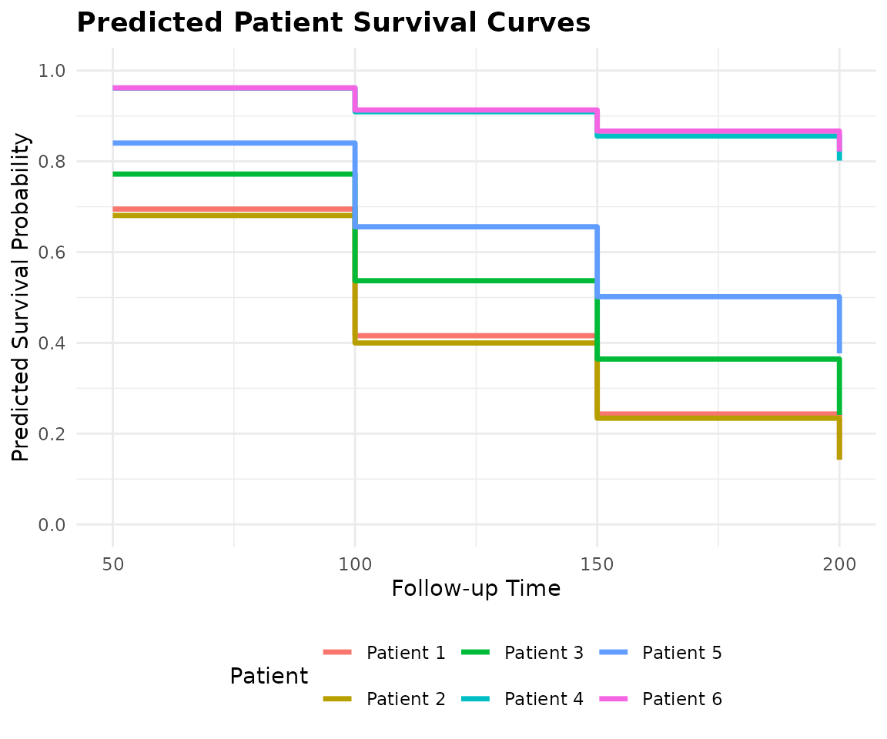

# 01. SuperSurv with Ensemble

## Introduction

The core feature of the `SuperSurv` package is its ability to combine
multiple base survival learners using cross-validated ensemble weights.
This tutorial walks through preparing data, defining a library of
models, fitting the Super Learner, and generating predictions for new
patients.

## 1. Load Data & Prepare Matrices

We will use the built-in `metabric` dataset, extracting the covariates
and performing a standard 80/20 train-test split.

``` r

library(SuperSurv)
library(survival)

# Load built-in METABRIC data
data("metabric", package = "SuperSurv")

# Use a fixed teaching subset so the package vignette remains quick to rebuild.
# The full-data comparison used in the manuscript is provided separately in the
# replication materials.
set.seed(42)
example_idx <- sample(seq_len(nrow(metabric)), 400)
metabric_example <- metabric[example_idx, ]
n_total <- nrow(metabric_example)
train_idx <- sample(1:n_total, 0.8 * n_total)

train <- metabric_example[train_idx, ]
test  <- metabric_example[-train_idx, ]

# Extract just the X covariates (assuming they are named x0, x1, etc.)
x_cols <- grep("^x", names(metabric), value = TRUE)
X_tr <- train[, x_cols]
X_te <- test[, x_cols]

# Define the prediction time grid (e.g., survival at 50, 100, 150, 200 months)
new.times <- c(50, 100, 150, 200)

common_control <- list(
  saveFitLibrary = TRUE,
  event.t.grid = seq(0, max(train$duration[train$event == 1]), length.out = 40),
  cens.t.grid = seq(0, max(train$duration[train$event == 0]), length.out = 40)
)
```

## 2. Define the Ensemble Library

We define a small library of parametric and tree-based survival models
for a reproducible demonstration.

``` r

my_library <- c("surv.coxph", "surv.weibull")
if (has_rpart) {
  my_library <- c(my_library, "surv.rpart")
}
```

## 3. Train the SuperSurv Metalearner

Before we run the main `SuperSurv` engine, it is important to understand
its key parameters. The Super Learner algorithm relies on
cross-validation to assign weights to the base models, and it must model
both the event and the censoring mechanism to avoid biased evaluations.

Here is the complete guide to the arguments you need to pass:

### The Data Inputs

- **`time`**: A numeric vector of the observed follow-up times for your
  training cohort.
- **`event`**: A numeric vector indicating the status at the observed
  time (typically `1` = event occurred, `0` = right-censored).
- **`X`**: A `data.frame` or matrix containing **only** the predictor
  variables (covariates) for the training set. Do not include the time
  or event columns here!
- **`newdata`**: (Optional) A `data.frame` of covariates for a
  validation or test set. If provided, `SuperSurv` will immediately
  generate predictions for these patients during the training phase,
  saving you a step.
- **`new.times`**: A numeric vector defining the exact time points where
  you want survival probabilities predicted (e.g.,
  `seq(50, 200, by = 25)`).

### The Model Libraries

- **`event.library`**: A character vector of the base algorithms used to
  predict the actual survival outcome (e.g., `"surv.coxph"`,
  `"surv.rpart"`).
- **`cens.library`**: The library used to estimate the *censoring*
  mechanism over time. `SuperSurv` uses these predictions to calculate
  Inverse Probability of Censoring Weights (IPCW). You can use the exact
  same library as your event models, or a simpler one.

### The Meta-Learner & Tuning

- **`metalearner`**: The objective used to calculate the final ensemble
  weights. `SuperSurv` offers two supported approaches:
  - `"brier"` (default): minimizes the IPCW pseudo-outcome squared
    criterion described in the package methodology.
  - `"logloss"`: minimizes a two-term IPCW log-loss. It penalizes
    overconfident incorrect probabilities more strongly than squared
    loss, but neither objective is expected to dominate in every
    dataset.
- **`nFolds`**: The number of cross-validation folds used to train the
  meta-learner. `V = 5` or `V = 10` is standard. This cross-validation
  is what prevents the ensemble from overfitting to the base learners.
- **`control = list(saveFitLibrary = TRUE)`**: This tells the engine to
  save the fitted base learners into the final object. This is
  **required** if you want to use the
  [`predict()`](https://rdrr.io/r/stats/predict.html) method on new
  patients later.
- **`verbose`**: Set to `TRUE` to print progress messages to the
  console. Highly recommended for large datasets or complex libraries so
  you can track the cross-validation progress.

Let’s fit two models with `verbose = FALSE` to see how the meta-learner
choice affects the final ensemble weights.

``` r

# Fit 1: Least Squares Meta-learner
set.seed(2026)
fit_ls <- SuperSurv(
  time = train$duration,
  event = train$event,
  X = X_tr,
  newdata = X_te,                 # Predict on the test set immediately
  new.times = new.times,       # Our evaluation time grid
  event.library = my_library,
  cens.library = my_library,
  metalearner = "brier", 
  control = common_control,
  verbose = FALSE,
  selection = "ensemble",
  nFolds = 3
)

# Fit 2: Negative Log-Likelihood Meta-learner
set.seed(2026) # Reuse the same cross-validation folds for a fair comparison.
fit_nll <- SuperSurv(
  time = train$duration,
  event = train$event,
  X = X_tr,
  newdata = X_te,
  new.times = new.times,
  event.library = my_library,
  cens.library = my_library,
  metalearner = "logloss",       # Swap to nloglik
  control = common_control,
  verbose = FALSE,
  selection = "ensemble",
  nFolds = 3
)
```

## 4. Package Object Interface

`SuperSurv` fits behave like ordinary R model objects. Use the print and
summary methods for a quick overview, and use accessors for common
fitted-model details.

``` r

fit_ls
#> SuperSurv fit
#>   Selection: ensemble 
#>   Event learners: 3 
#>   Censoring learners: 3 
#>   Predictions: 80 observations x 4 times
#>   Evaluation times: 4 values from 50 to 200 
#>   Nonzero event weights:
#> surv.weibull_screen.all   surv.coxph_screen.all   surv.rpart_screen.all 
#>                  0.5387                  0.3600                  0.1013

summary(fit_ls)
#> Summary of SuperSurv fit
#>   Selection: ensemble 
#> 
#> Call:
#> SuperSurv(time = train$duration, event = train$event, X = X_tr, 
#>     newdata = X_te, new.times = new.times, event.library = my_library, 
#>     cens.library = my_library, verbose = FALSE, control = common_control, 
#>     metalearner = "brier", selection = "ensemble", nFolds = 3)
#> 
#> Event ensemble:
#>                  learner weight   risk status
#>  surv.weibull_screen.all 0.5387 0.8656     ok
#>    surv.coxph_screen.all 0.3600 0.8656     ok
#>    surv.rpart_screen.all 0.1013 0.8981     ok
#> 
#> Censoring ensemble:
#>                  learner weight   risk status
#>  surv.weibull_screen.all 0.6631 0.8174     ok
#>    surv.coxph_screen.all 0.0947 0.8181     ok
#>    surv.rpart_screen.all 0.2423 0.8303     ok
#> 
#> Predictions: 80 observations x 4 times
#> Evaluation times: 4 values from 50 to 200 
#> Elapsed time (seconds):
#> everything      train    predict 
#>      5.062      4.956      0.104

event_weights(fit_ls)
#>   surv.coxph_screen.all surv.weibull_screen.all   surv.rpart_screen.all 
#>               0.3600037               0.5386712               0.1013251

learner_names(fit_ls)
#> [1] "surv.coxph_screen.all"   "surv.weibull_screen.all"
#> [3] "surv.rpart_screen.all"

eval_times(fit_ls)
#> [1]  50 100 150 200

selected_variables(fit_ls, learner = 1)
#> [1] "x0" "x1" "x2" "x3" "x4" "x5" "x6" "x7" "x8"
```

## 5. Compare the Fitting Objectives

With `selection = "ensemble"`, the meta-learner estimates a convex
combination of the candidate predictions under the selected
cross-validated objective. The two objectives can produce different
weights.

First inspect the fitted weights and algorithm summaries.

``` r

cat("\n--- LEAST SQUARES METALEARNER ---\n")
#> 
#> --- LEAST SQUARES METALEARNER ---
summary(fit_ls)
#> Summary of SuperSurv fit
#>   Selection: ensemble 
#> 
#> Call:
#> SuperSurv(time = train$duration, event = train$event, X = X_tr, 
#>     newdata = X_te, new.times = new.times, event.library = my_library, 
#>     cens.library = my_library, verbose = FALSE, control = common_control, 
#>     metalearner = "brier", selection = "ensemble", nFolds = 3)
#> 
#> Event ensemble:
#>                  learner weight   risk status
#>  surv.weibull_screen.all 0.5387 0.8656     ok
#>    surv.coxph_screen.all 0.3600 0.8656     ok
#>    surv.rpart_screen.all 0.1013 0.8981     ok
#> 
#> Censoring ensemble:
#>                  learner weight   risk status
#>  surv.weibull_screen.all 0.6631 0.8174     ok
#>    surv.coxph_screen.all 0.0947 0.8181     ok
#>    surv.rpart_screen.all 0.2423 0.8303     ok
#> 
#> Predictions: 80 observations x 4 times
#> Evaluation times: 4 values from 50 to 200 
#> Elapsed time (seconds):
#> everything      train    predict 
#>      5.062      4.956      0.104

cat("\n--- NLOGLIK METALEARNER ---\n")
#> 
#> --- NLOGLIK METALEARNER ---
summary(fit_nll)
#> Summary of SuperSurv fit
#>   Selection: ensemble 
#> 
#> Call:
#> SuperSurv(time = train$duration, event = train$event, X = X_tr, 
#>     newdata = X_te, new.times = new.times, event.library = my_library, 
#>     cens.library = my_library, verbose = FALSE, control = common_control, 
#>     metalearner = "logloss", selection = "ensemble", nFolds = 3)
#> 
#> Event ensemble:
#>                  learner weight   risk status
#>  surv.weibull_screen.all 0.6619 0.5515     ok
#>    surv.coxph_screen.all 0.3358 0.5541     ok
#>    surv.rpart_screen.all 0.0023 0.7276     ok
#> 
#> Censoring ensemble:
#>                  learner weight   risk status
#>  surv.weibull_screen.all 0.7401 0.8510     ok
#>    surv.coxph_screen.all 0.0154 0.8519     ok
#>    surv.rpart_screen.all 0.2445 0.8639     ok
#> 
#> Predictions: 80 observations x 4 times
#> Evaluation times: 4 values from 50 to 200 
#> Elapsed time (seconds):
#> everything      train    predict 
#>     75.662     75.567      0.094
```

Then evaluate both fitted ensembles on the same held-out observations
using both IPCW Brier score and IPCW log-loss. This comparison
illustrates the objectives without assuming in advance that one must
perform better.

``` r

benchmark_ls <- eval_benchmark(
  fit_ls, X_te, test$duration, test$event, new.times
)
benchmark_nll <- eval_benchmark(
  fit_nll, X_te, test$duration, test$event, new.times
)

objective_comparison <- rbind(
  transform(
    benchmark_ls$summary[benchmark_ls$summary$Model == "SuperSurv_Ensemble", ],
    Fitting_Objective = "Brier"
  ),
  transform(
    benchmark_nll$summary[benchmark_nll$summary$Model == "SuperSurv_Ensemble", ],
    Fitting_Objective = "Log-loss"
  )
)
objective_comparison[, c("Fitting_Objective", "IBS", "IPCW_LogLoss", "Uno_C", "iAUC")]
#>   Fitting_Objective       IBS IPCW_LogLoss     Uno_C      iAUC
#> 1             Brier 0.2062459    0.5970542 0.6163364 0.6616964
#> 2          Log-loss 0.2084490    0.6021272 0.6134644 0.6553774
```

`event_weights(fit)` reports each learner’s contribution to the final
convex combination. A zero weight means that the learner does not
contribute to that fitted ensemble. The held-out table, rather than the
training objective alone, should guide interpretation of predictive
performance.

## 6. Generating Predictions on New Data

If you passed `newdata` during the training phase, `SuperSurv` already
calculated the predictions for your test set. However, in a real-world
clinical setting, you will often train the model once and then predict
on brand new patients months later.

Because we set `control = list(saveFitLibrary = TRUE)` during training,
we can use the standard R
[`predict()`](https://rdrr.io/r/stats/predict.html) method.

``` r

# Select 3 brand new patients from our test set
new_patients <- X_te[1:6, ]

# Generate predictions using the Least Squares ensemble
ensemble_preds <- predict(
  object = fit_ls, 
  newdata = new_patients, 
  new.times = new.times,
  type = "event"
)

cat("\n--- PREDICTED SURVIVAL PROBABILITIES ---\n")
#> 
#> --- PREDICTED SURVIVAL PROBABILITIES ---
final_matrix <- ensemble_preds
colnames(final_matrix) <- paste0("Time_", new.times)
rownames(final_matrix) <- paste0("Patient_", 1:6)

print(round(final_matrix, 4))
#>           Time_50 Time_100 Time_150 Time_200
#> Patient_1  0.6948   0.4158   0.2433   0.1430
#> Patient_2  0.6807   0.3997   0.2340   0.1423
#> Patient_3  0.7720   0.5369   0.3643   0.2414
#> Patient_4  0.9617   0.9093   0.8558   0.8017
#> Patient_5  0.8404   0.6558   0.5018   0.3769
#> Patient_6  0.9619   0.9132   0.8668   0.8217
```

### Understanding the Output Matrix:

With `type = "event"`,
[`predict()`](https://rdrr.io/r/stats/predict.html) returns the
event-survival probability matrix directly. \* **Rows ($`N`$)**:
Represent individual patients. \* **Columns ($`T`$)**: Represent the
specific time points we defined in `new.times`. \* **Values**: The
estimated probability that the patient will *survive* past that specific
time point. As time increases (moving left to right across a row), the
survival probability naturally decreases.

## 7. Visualizing Patient-Specific Predictions

While raw probability matrices ($`N \times T`$) are perfect for
downstream coding and performance benchmarking, they are difficult to
interpret clinically. Doctors and researchers need to see the actual
survival trajectories.

`SuperSurv` includes a built-in
[`plot_predict()`](https://yuelyu21.github.io/SuperSurv/reference/plot_predict.md)
function to effortlessly translate this matrix into publication-ready
survival curves for individual patients.

This plotting example runs only when the optional `ggplot2` package is
installed; fitting and numerical prediction do not require it.

``` r

# Plot the predicted survival curves for our 3 new patients (Rows 1, 2, and 3)
plot_predict(
  preds = ensemble_preds,
  eval_times = new.times,
  patient_idx = 1:6
)
```



## 8. Next Steps

You now know how to prepare data, define a model library, choose a
meta-learner, and generate patient-specific survival curves.

Before applying a model, evaluate the ensemble and its component
learners on appropriately held-out data. Head to **Tutorial 2: Model
Performance & Benchmarking** for numerical and graphical examples using
time-dependent Brier score, AUC, and Uno’s C-index.
